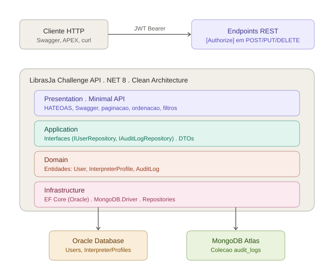

# LibrasJa Challenge API

API REST construída em **.NET 8** com **Clean Architecture** para o projeto **LibrasJá** — plataforma de inclusão digital que conecta pessoas surdas a intérpretes de Libras (Língua Brasileira de Sinais).

> **Sprint 4 — Advanced Business Development with .NET (FIAP 2026)**

---

## Integrantes

| Nome | RM |
|---|---|
| Ivanildo Alfredo da Silva Filho | RM560049 |
| Jennyfer Lee | RM561020 |
| Letícia Sousa Prado Silva | RM559258 |

---

## Visão geral

O LibrasJá é uma solução completa para facilitar o acesso de pessoas surdas a intérpretes de Libras em locais públicos (hospitais, escolas, repartições). Esta API expõe os recursos de cadastro de **usuários** (surdos e intérpretes) e **perfis de intérpretes**, com autenticação JWT, persistência em Oracle e auditoria em MongoDB Atlas.

## Arquitetura



A solução segue o padrão **Clean Architecture** com 4 projetos:

- **LibrasJaChallenge** (Presentation) — Minimal API .NET 8 com endpoints REST, JWT, Swagger e HATEOAS
- **LibrasJa.Application** — Interfaces dos repositórios e DTOs
- **LibrasJa.Domain** — Entidades de negócio (User, InterpreterProfile, AuditLog)
- **LibrasJa.Infrastructure** — Implementações concretas (EF Core Oracle, MongoDB.Driver)

Mais dois projetos para testes:

- **LibrasJa.Tests.Unit** — Testes unitários com xUnit + Moq (padrão AAA)
- **LibrasJa.Tests.Integration** — Testes de integração com WebApplicationFactory + InMemoryDb

## Tecnologias utilizadas

| Categoria | Tecnologia |
|---|---|
| Linguagem | C# 12 |
| Runtime | .NET 8 |
| API | ASP.NET Core Minimal API |
| ORM relacional | Entity Framework Core 9 + Oracle Provider |
| Banco relacional | Oracle Database (FIAP) |
| Banco NoSQL | MongoDB Atlas (MongoDB.Driver 3.0) |
| Autenticação | JWT Bearer |
| Documentação | Swagger / OpenAPI |
| Logging | Serilog (Console + File) |
| Observabilidade | OpenTelemetry (Tracing + Metrics) |
| Health Checks | AspNetCore.HealthChecks (Oracle, MongoDB, API) |
| Testes | xUnit, Moq, Microsoft.AspNetCore.Mvc.Testing |

## Endpoints principais

### Auth
- `POST /api/auth/login` — gera o token JWT (qualquer username válido + senha `1234`; `admin` recebe role `admin`)

### Users
- `GET /api/users` — lista todos os usuários (público)
- `GET /api/users/{id}` — busca por id com links HATEOAS (público)
- `GET /api/users/search?search=&page=&pageSize=&orderBy=&orderDir=` — paginação, filtro e ordenação (público)
- `POST /api/users` — cria usuário (requer JWT)
- `PUT /api/users/{id}` — atualiza usuário (requer JWT)
- `DELETE /api/users/{id}` — remove usuário (requer JWT com role `admin`)

### Interpreters
- `GET /api/interpreters` — lista todos os perfis de intérprete (público)
- `GET /api/interpreters/{id}` — busca por id com links HATEOAS (público)
- `GET /api/interpreters/search?search=&page=&pageSize=&orderBy=&orderDir=` — paginação, filtro e ordenação (público)
- `POST /api/interpreters` — cria perfil (requer JWT)
- `PUT /api/interpreters/{id}` — atualiza perfil (requer JWT)
- `DELETE /api/interpreters/{id}` — remove perfil (requer JWT com role `admin`)

### Audit Logs (MongoDB)
- `GET /api/audit-logs` — lista os últimos 100 logs de auditoria (requer JWT)
- `GET /api/audit-logs/{entity}` — filtra logs por entidade (requer JWT)

### Monitoramento
- `GET /health` — health checks (Oracle, MongoDB e API)
- `GET /swagger` — documentação interativa

## Instalação e execução

### Pré-requisitos
- .NET 8 SDK
- Acesso ao Oracle Database da FIAP (ou ajustar connection string)
- Conta MongoDB Atlas (a string já está configurada no `appsettings.json`)

### Passos

```bash
@'
# LibrasJa Challenge API

API REST construída em **.NET 8** com **Clean Architecture** para o projeto **LibrasJá** — plataforma de inclusão digital que conecta pessoas surdas a intérpretes de Libras (Língua Brasileira de Sinais).

> **Sprint 4 — Advanced Business Development with .NET (FIAP 2026)**

---

## Integrantes

| Nome | RM |
|---|---|
| Ivanildo Alfredo da Silva Filho | RM560049 |
| Jennyfer Lee | RM561020 |
| Letícia Sousa Prado Silva | RM559258 |

---

## Visão geral

O LibrasJá é uma solução completa para facilitar o acesso de pessoas surdas a intérpretes de Libras em locais públicos (hospitais, escolas, repartições). Esta API expõe os recursos de cadastro de **usuários** (surdos e intérpretes) e **perfis de intérpretes**, com autenticação JWT, persistência em Oracle e auditoria em MongoDB Atlas.

## Arquitetura


A solução segue o padrão **Clean Architecture** com 4 projetos:

- **LibrasJaChallenge** (Presentation) — Minimal API .NET 8 com endpoints REST, JWT, Swagger e HATEOAS
- **LibrasJa.Application** — Interfaces dos repositórios e DTOs
- **LibrasJa.Domain** — Entidades de negócio (User, InterpreterProfile, AuditLog)
- **LibrasJa.Infrastructure** — Implementações concretas (EF Core Oracle, MongoDB.Driver)

Mais dois projetos para testes:

- **LibrasJa.Tests.Unit** — Testes unitários com xUnit + Moq (padrão AAA)
- **LibrasJa.Tests.Integration** — Testes de integração com WebApplicationFactory + InMemoryDb

## Tecnologias utilizadas

| Categoria | Tecnologia |
|---|---|
| Linguagem | C# 12 |
| Runtime | .NET 8 |
| API | ASP.NET Core Minimal API |
| ORM relacional | Entity Framework Core 9 + Oracle Provider |
| Banco relacional | Oracle Database (FIAP) |
| Banco NoSQL | MongoDB Atlas (MongoDB.Driver 3.0) |
| Autenticação | JWT Bearer |
| Documentação | Swagger / OpenAPI |
| Logging | Serilog (Console + File) |
| Observabilidade | OpenTelemetry (Tracing + Metrics) |
| Health Checks | AspNetCore.HealthChecks (Oracle, MongoDB, API) |
| Testes | xUnit, Moq, Microsoft.AspNetCore.Mvc.Testing |

## Endpoints principais

### Auth
- `POST /api/auth/login` — gera o token JWT (qualquer username válido + senha `1234`; `admin` recebe role `admin`)

### Users
- `GET /api/users` — lista todos os usuários (público)
- `GET /api/users/{id}` — busca por id com links HATEOAS (público)
- `GET /api/users/search?search=&page=&pageSize=&orderBy=&orderDir=` — paginação, filtro e ordenação (público)
- `POST /api/users` — cria usuário (requer JWT)
- `PUT /api/users/{id}` — atualiza usuário (requer JWT)
- `DELETE /api/users/{id}` — remove usuário (requer JWT com role `admin`)

### Interpreters
- `GET /api/interpreters` — lista todos os perfis de intérprete (público)
- `GET /api/interpreters/{id}` — busca por id com links HATEOAS (público)
- `GET /api/interpreters/search?search=&page=&pageSize=&orderBy=&orderDir=` — paginação, filtro e ordenação (público)
- `POST /api/interpreters` — cria perfil (requer JWT)
- `PUT /api/interpreters/{id}` — atualiza perfil (requer JWT)
- `DELETE /api/interpreters/{id}` — remove perfil (requer JWT com role `admin`)

### Audit Logs (MongoDB)
- `GET /api/audit-logs` — lista os últimos 100 logs de auditoria (requer JWT)
- `GET /api/audit-logs/{entity}` — filtra logs por entidade (requer JWT)

### Monitoramento
- `GET /health` — health checks (Oracle, MongoDB e API)
- `GET /swagger` — documentação interativa

## Instalação e execução

### Pré-requisitos
- .NET 8 SDK
- Acesso ao Oracle Database da FIAP (ou ajustar connection string)
- Conta MongoDB Atlas (a string já está configurada no `appsettings.json`)

### Passos

```bash
git clone https://github.com/Jennyfer56/LibrasJaChallenge.git
cd LibrasJaChallenge
dotnet restore
dotnet build
dotnet run
```

A API sobe em `https://localhost:7178` e `http://localhost:5011`. O Swagger fica disponível em `https://localhost:7178/swagger`.

### Configuração

O arquivo `appsettings.json` contém:

```json
{
  "ConnectionStrings": {
    "Oracle": "User Id=rm561020;Password=SUA_SENHA;Data Source=oracle.fiap.com.br:1521/orcl",
    "MongoDb": "mongodb+srv://...@cluster0.ta3iq9b.mongodb.net/..."
  },
  "Jwt": { "Key": "...", "Issuer": "...", "Audience": "...", "ExpiresInMinutes": 120 },
  "MongoDb": { "DatabaseName": "librasja_audit", "CollectionName": "audit_logs" }
}
```

> **Importante**: trocar `SUA_SENHA` pela senha real do Oracle FIAP antes de rodar.

## Testes

Total: **19 testes automatizados** (11 unitários + 8 de integração), todos passando.

```bash
dotnet test
```

### Testes unitários (LibrasJa.Tests.Unit)
- Padrão AAA (Arrange, Act, Assert)
- xUnit + Moq
- Cobertura: repositórios da camada de Application

### Testes de integração (LibrasJa.Tests.Integration)
- `Microsoft.AspNetCore.Mvc.Testing` com `WebApplicationFactory<Program>`
- Banco em memória (`UseInMemoryDatabase`)
- Cobertura: login, autorização JWT, endpoints de Users, health check

## Critérios da Sprint 4 atendidos

| Critério | Pontos | Atendido |
|---|---|---|
| Clean Architecture com separação de camadas | 30 | ✅ |
| Princípios SOLID e Clean Code | — | ✅ |
| Injeção de Dependência | — | ✅ |
| Tratamento global de exceções (ProblemDetails RFC 7807) | — | ✅ |
| Swagger/OpenAPI atualizado com botão Authorize | 20 | ✅ |
| Paginação, ordenação e filtros | — | ✅ |
| HATEOAS nos endpoints de consulta | — | ✅ |
| Autenticação JWT + Autorização por role | — | ✅ |
| EF Core com Oracle | 20 | ✅ |
| MongoDB integrado para auditoria | — | ✅ |
| Padrão Repository | — | ✅ |
| Health Checks (Oracle, MongoDB, API) | 20 | ✅ |
| Logging estruturado (Serilog) | — | ✅ |
| Testes unitários AAA (xUnit + Moq) | — | ✅ |
| Testes de integração (WebApplicationFactory) | — | ✅ |
| README + diagrama de arquitetura + Swagger | 10 | ✅ |

## Estrutura do repositórioLibrasJaChallenge/
├── LibrasJaChallenge.csproj          # API principal (Minimal API)
├── Program.cs                         # Configuração e endpoints
├── appsettings.json                   # Connection strings + JWT
├── arquitetura.svg                    # Diagrama da arquitetura
├── README.md
├── Auth/
│   └── JwtTokenService.cs             # Serviço de geração de token
├── Middleware/
│   └── GlobalExceptionHandlerMiddleware.cs   # ProblemDetails RFC 7807
├── DTOs/
│   ├── CreateUserDto.cs
│   ├── CreateInterpreterDto.cs
│   └── UpdateInterpreterDto.cs
├── LibrasJa.Domain/                   # Entidades
│   └── Entities/
│       ├── User.cs
│       ├── InterpreterProfile.cs
│       └── AuditLog.cs
├── LibrasJa.Application/              # Interfaces e DTOs
│   └── Interfaces/
│       ├── IUserRepository.cs
│       ├── IInterpreterProfileRepository.cs
│       └── IAuditLogRepository.cs
├── LibrasJa.Infrastructure/           # Implementações concretas
│   ├── Data/
│   │   └── AppDbContext.cs            # EF Core Oracle
│   ├── Repositories/
│   │   ├── UserRepository.cs
│   │   └── InterpreterProfileRepository.cs
│   └── Mongo/
│       └── MongoAuditLogRepository.cs # Repositório MongoDB
├── LibrasJa.Tests.Unit/               # 11 testes unitários
└── LibrasJa.Tests.Integration/        # 8 testes de integração
## Licença

Projeto acadêmico desenvolvido para a FIAP — uso educacional.
